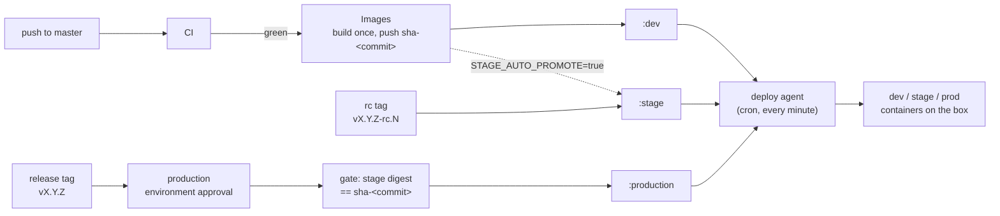

# Environment pipeline runbook

Operator reference for how a commit becomes `dev` -> `stage` -> `production`
on yuriodev.co.uk. For the site's overall architecture see the repo root
`CLAUDE.md`; this file covers the pipeline only.

## Overview



Nothing is ever rebuilt after `images.yml`: every later step is a
`docker buildx imagetools create --prefer-index=false` retag, so the exact
same digest that passed CI is what production eventually runs. The deploy
agent is the only thing that ever touches the app containers on the box; the
workflows only move registry tags. The proxy is the exception: it runs a
public nginx image pinned by digest and is only ever recreated by hand (see
"The proxy image" below).

## How to release

1. **Land on `master`.** A push to `master` triggers `.github/workflows/ci.yml`:
   `frontend` (typecheck, lint at 0 problems, `npm run test`, build, `npm audit
   --audit-level=high`), `backend` (`ruff check`, `ruff format --check`, strict
   `mypy`, `python -m pytest -q --cov` with a 90% branch-coverage gate, and a
   Trivy scan of the pinned `backend/requirements.txt` that fails on a fixable
   HIGH/CRITICAL CVE), `guards` (`scripts/check-compose.py` plus
   `docker compose ... config --quiet` on every compose file) and `images`
   (build-only `runtime` + `dev` targets, no push). The proxy's Trivy scan is a
   separate workflow (`proxy-image.yml`, "The proxy image" below), so it never
   holds up app images. On green CI, `.github/workflows/images.yml` fires via
   `workflow_run`, builds each service's `runtime` target once, pushes
   `ghcr.io/yuriioks/yuriodev-{frontend,backend}:sha-<commit>`, scans it with
   Trivy (blocks on a fixable HIGH/CRITICAL CVE), and — only if that
   passes — retags `:dev` to that digest. The deploy agent picks up `:dev` on
   its next run (within a minute) and `dev.yuriodev.co.uk` updates itself —
   no manual step.
2. **Promote to stage** once you want a specific commit on
   `stage.yuriodev.co.uk`:
   ```bash
   git fetch origin && git log HEAD..origin/master --oneline   # confirm the commit is on master and CI/Images are green
   git tag v1.4.0-rc.1 <commit-sha>
   git push origin v1.4.0-rc.1
   ```
   This runs `.github/workflows/promote-stage.yml`, which requires the tag to
   point at a commit that is an ancestor of `origin/master` and waits for
   both `CI` and `Images` to report success for that exact SHA before
   retagging `:stage`. Same rc tag naming, iterate `-rc.2`, `-rc.3`, ... for
   fixes.
3. **Promote to production** once stage has been verified:
   ```bash
   git tag v1.4.0 <commit-sha>
   git push origin v1.4.0
   ```
   This runs `.github/workflows/promote-production.yml` under the `production`
   GitHub environment, which requires reviewer approval (`YuriiOks`) in the
   Actions UI before the job continues. The gate step then re-checks that
   `:stage` for both `frontend` and `backend` is running the exact digest of
   `sha-<tagged commit>` — if stage has since moved on, the promotion fails
   and tells you to promote to stage first. On success it retags
   `:production`, fast-forwards the `production` branch to that commit, and
   creates a GitHub Release named `v1.4.0` listing both image digests (this
   is also the rollback reference — see below).
4. The deploy agent notices the moved `:production` tag on its next run and
   recreates the changed service(s) on the live box.

Tag regex reminder: `promote-stage.yml` only acts on
`^v[0-9]+\.[0-9]+\.[0-9]+-rc\.[0-9]+$`; `promote-production.yml` only acts on
`^v[0-9]+\.[0-9]+\.[0-9]+$` (no `-rc` suffix). A tag that matches neither is a
no-op for both workflows. Both `v*` tags are admin-only to create per the
repo ruleset.

## Automatic stage promotion

While the repo variable `STAGE_AUTO_PROMOTE` is `true`, every green
`images.yml` run also retags `:stage` to the commit it just built — stage
then tracks every master push, same as dev, and you can skip step 2 above
entirely. Toggle it:
```bash
gh variable set STAGE_AUTO_PROMOTE --body true    # stage tracks master automatically
gh variable set STAGE_AUTO_PROMOTE --body false   # stage only moves on an explicit rc tag
gh variable list                                  # check the current value
```

## Dry-run mode

The repo variable `PROD_DRY_RUN`, when `true`, makes
`promote-production.yml` run every check (ancestry, approval, the
stage-digest gate) and write its summary, but skip the actual retag, the
`production` branch fast-forward, and the GitHub Release — nothing changes.
Useful for rehearsing a release tag or testing the gate logic without moving
production.
```bash
gh variable set PROD_DRY_RUN --body true
gh variable set PROD_DRY_RUN --body false
```

## The deploy agent

`deploy/agent/yuriodev-deploy.sh`, invoked every minute from the user
crontab:
```
* * * * * ENABLED_ENVS="dev stage" /home/yurii/yuriodev-deployment/deploy/agent/yuriodev-deploy.sh
```
For each environment named in `ENABLED_ENVS` (space-separated; e.g. `"dev
stage prod"`) it reads that environment's compose file (`deploy/dev/compose.yml`,
`deploy/stage/compose.yml`, or the root `docker-compose.yml` for `prod`),
finds every service whose `image:` starts with `ghcr.io/`, pulls it
anonymously (the GHCR packages are public; the server holds no registry
credentials), and — only if the pulled image ID differs from what the
running container has — recreates that one service with
`docker compose up -d --no-deps <svc>`. It then waits for the new container
to come healthy before logging it as deployed: both the frontend and backend
images carry a Dockerfile `HEALTHCHECK`, so it polls `docker inspect`'s
`.State.Health.Status` for up to ~90s; only an image without a `HEALTHCHECK`
(an older, pre-hardening image) falls back to a request through the proxy
container (`GET /` for frontends, `GET /health` for backends, up to 6 tries
5s apart). If the new container doesn't come healthy, it puts the previous
image back (see "Automatic rollback and quarantine" below). It never touches
a service that isn't already updated, and it
never builds anything, and it never reacts to an `env/` file changing — only
to a changed image ID (see "Environment config" below).

- **Kill switch:** `touch ~/.yuriodev-deploy-paused` — the agent exits
  immediately on its next run without touching any container. Running
  containers keep running. Remove the file to resume.
- **Log:** `~/.local/state/yuriodev-deploy.log` (the agent's own structured
  lines: `<timestamp> <env> <svc> DEPLOYED|FAILED|ROLLED BACK|ROLLBACK
  FAILED|SKIPPED|QUARANTINE lifted|ERROR|REFUSED ...`, plus `WARN` lines
  about the optional alert files and about state files it could not write;
  a `WARN` for a condition that persists, such as a mis-permissioned URL file
  or an unreachable ping endpoint, is logged once, and again only after the
  condition has cleared and come back). Writing the log, the quarantine files
  or a `WARN` marker never stops a run: with a full disk the agent still rolls
  back and alerts. Once it passes 5 MB it is rotated to
  `.log.1` (older ones shift to `.2` and `.3`; the fourth is dropped). The
  crontab additionally redirects raw stdout/stderr to
  `~/.local/state/yuriodev-deploy.cron.log`, which is not rotated.
- **Heartbeat:** `~/.local/state/yuriodev-deploy.heartbeat` — touched at the
  end of every run that wasn't paused/locked-out; a stale timestamp means the
  agent stopped running, or aborted on an unexpected error (look for
  `ERROR agent aborted at line N` in the log, then the crontab and the cron log).
- **Lock:** the script takes a non-blocking `flock` on
  `~/.local/state/yuriodev-deploy.lock`, so an overrunning invocation (a
  rollback can take a few minutes of health waits) is skipped rather than
  overlapped.
- **Exit status:** 0, or 1 when any enabled environment logged an
  `ERROR`/`FAILED`/`REFUSED` line (a failed pull included), or has a service
  marked `.broken` (below: no healthy image left running). One environment
  failing never stops the others from being processed.

### Automatic rollback and quarantine

Before recreating a service the agent records the image ID the running
container uses. It then runs `docker compose up -d --no-deps <svc>` and waits
for health as above.

**`compose up` fails and nothing changed** (the container still runs the
previous image, so the new one never ran; typically a daemon, port or compose
problem): the agent logs `<env> <svc> FAILED compose up while deploying
<repo@sha256:...>; nothing was recreated (still running <image ID>); retrying
next run`, alerts once for that digest, exits 1, and retries every minute.
Nothing is rolled back or quarantined, because the release itself may be fine.
Dev and stage keep serving the old image meanwhile.

**The new container does not come healthy** (or `compose up` failed after it
had already replaced the container), the agent:

1. logs `<env> <svc> FAILED health check after deploying <repo@sha256:...>;
   rolling back to <previous image ID>` (`FAILED compose up while deploying`
   in the second case);
2. saves the failed container's health status and last 200 log lines to
   `~/.local/state/yuriodev-deploy.quarantine/<env>.<svc>.failed.log`.
   The rollback recreates the container, and that deletes the container and
   its logs, so after a rollback `docker compose logs` only shows the
   rolled-back container. This file is the only record of why the new image
   failed;
3. points the local tag (`:dev` / `:stage` / `:production`) back at the
   previous image ID and recreates the service from it
   (`docker compose up -d --no-deps --force-recreate <svc>`), then waits for
   health again. On success it logs `ROLLED BACK to ...`. Otherwise it logs
   `ROLLBACK FAILED to ... (<cause>)`, where the cause is `re-tagging the
   previous image failed`, `compose up of the previous image failed` or `the
   previous image is unhealthy too`;
4. quarantines the failed digest in
   `~/.local/state/yuriodev-deploy.quarantine/<env>.<svc>` and keeps a local
   copy of the failed image as `<repo>:quarantined-<env>`, so the next pulls
   don't download it again;
5. sends the optional alert (below) and exits 1.

A service that had no container yet has nothing to roll back to: the agent
logs `FAILED ... no previous container to roll back to`, saves the same
`.failed.log`, quarantines and alerts.

**Broken services.** After `ROLLBACK FAILED`, or a failed first deploy, no
healthy image is left running. The agent then also writes
`<env>.<svc>.broken`, and every later run exits 1 and skips the success ping
while that file exists. The dead-man's switch below therefore stays down
until the problem is resolved; it does not clear itself a minute later. The
first skipped run logs `SKIPPED quarantined ...; ERROR no healthy image is
running, needs a human`. The marker is removed when the quarantine lifts
(below), when that service deploys successfully, or when you reset it by
hand.

While the registry tag still points at the quarantined digest, every run
pulls it, sees it is quarantined, and skips the service. It also points the
local tag back at the running image, or removes the local tag if no container
exists, so a manual `docker compose up` can't start the failed image either.
It logs `SKIPPED quarantined ...` once, not every minute.
The quarantine lifts by itself as soon as the registry tag moves to any other
digest (a new master commit for dev, a new rc tag for stage,
`rollback-production.yml` or a new release for prod): the agent logs
`QUARANTINE lifted: the tag moved from ... to ...`, drops the held copy, the
`.failed.log` and any `.broken` marker, and deploys the new digest as usual
(or does nothing, if the tag moved back to what is already running).

Diagnosing a quarantined digest:
```bash
ls ~/.local/state/yuriodev-deploy.quarantine/                              # one set of files per <env>.<svc>
cat ~/.local/state/yuriodev-deploy.quarantine/dev.frontend-dev             # the quarantined digest
cat ~/.local/state/yuriodev-deploy.quarantine/dev.frontend-dev.failed.log  # health + last 200 log lines of the failed container
docker run --rm ghcr.io/yuriioks/yuriodev-frontend:quarantined-dev         # reproduce by hand (Ctrl-C to stop; backends need their env: add --env-file env/<env>.env)
```
The held image runs with no network, env file or limits from the compose
file, so a failure that comes from the environment (a missing secret, the
proxy, the network) may not reproduce this way.

To retry the **same** digest by hand, for example after fixing an
environment-side cause such as a missing secret:
```bash
rm -f ~/.local/state/yuriodev-deploy.quarantine/dev.frontend-dev \
      ~/.local/state/yuriodev-deploy.quarantine/dev.frontend-dev.*   # the digest, .noted, .broken, .failed.log, .upfailed
tail -f ~/.local/state/yuriodev-deploy.log                            # the next run (within a minute) deploys it again
```
(`rm -rf ~/.local/state/yuriodev-deploy.quarantine` resets every service.) The
held `<repo>:quarantined-<env>` image is removed on the next successful
deploy of that service.

This only catches an image that fails its health check. A release that is
healthy but wrong still needs the release rollback below.

### Alerts and a dead-man's switch (optional, off by default)

Two optional files, each holding one `http(s)://` URL on its first line. The
agent ignores a file (and logs a `WARN`, once) unless it is owned by `yurii`
and has mode 600 (or 400), and it never writes either URL to its log. Nothing
lives in the repo.

- `~/.config/yuriodev/deploy-alert-url`: on every `FAILED`, `ROLLED BACK` or
  `ROLLBACK FAILED`, the agent POSTs a one-line plain-text message
  (`curl -fsS -m 10 --retry 2 --data-binary "<message>" <url>`). Messages
  that need action end in `needs a human`. A `FAILED compose up` that
  changed nothing alerts once per digest, not every minute. Anything that
  accepts a plain POST body works; an ntfy.sh topic URL
  (`https://ntfy.sh/<long-random-topic>`) is the simplest. A failed delivery
  is logged as `WARN alert delivery failed` and never stops the run.
- `~/.config/yuriodev/deploy-ping-url`: a plain GET at the end of every run
  that exited 0. Point it at a healthchecks.io check
  (`https://hc-ping.com/<uuid>`) with a period of 1 minute and a grace time
  of about 10 minutes. The check goes down, and emails you, when the agent
  stops running, aborts, keeps failing (a GHCR outage longer than the grace
  time included), or has a `.broken` service. A service that was **rolled
  back** successfully and is now quarantined still counts as 0 and still
  pings: it is serving a healthy image, and the alert URL has already told
  you about it. Paused or locked-out runs don't ping, so pausing the agent
  for longer than the grace time also alerts; pause the check in
  healthchecks.io first if that is planned. An unreachable ping endpoint is
  logged as `WARN success ping failed`, once, until a ping gets through again.

Recommended setup: an ntfy topic (or any other push channel) for the alert
URL, and a separate healthchecks.io check only for the ping URL. If you point
both at one healthchecks.io check instead (`https://hc-ping.com/<uuid>/fail`
as the alert URL), a rollback flips the check down and the next successful run
flips it straight back up. That is correct for a rolled-back service, but the
"down" can be easy to miss, so read the alert itself.
```bash
mkdir -p ~/.config/yuriodev && chmod 700 ~/.config/yuriodev
( umask 077 && printf '%s\n' 'https://ntfy.sh/<long-random-topic>' > ~/.config/yuriodev/deploy-alert-url )
( umask 077 && printf '%s\n' 'https://hc-ping.com/<uuid>'          > ~/.config/yuriodev/deploy-ping-url )
stat -c '%a %U %n' ~/.config/yuriodev/deploy-*-url                 # expect 600 yurii
```
Remove a file to switch that part off again.

## The proxy image (`yuriodev-proxy`)

The root `docker-compose.yml` pins the proxy as
`nginx:stable-alpine@sha256:<digest>` and mounts `./nginx-proxy` read-only
(`:ro`; nginx never writes there, the host still edits it and reloads per the
golden rules). The first pin (2026-09-25; `docker-compose.yml` holds the
current one),
`sha256:985220252f3863977e468f611ef118ebd01421289dd86ee1ae99cb068c3bce2b`, was
the multi-arch index behind `stable-alpine` (the same index as `1.30-alpine`
and `stable-alpine3.24`): nginx 1.30.5 on Alpine 3.24, built 2026-09-22. Before
it, the proxy ran whatever `nginx:stable-alpine` happened to be cached on the
box (nginx 1.28.0).

**What the deploy agent does with the proxy: nothing.** `services_of()` in
`deploy/agent/yuriodev-deploy.sh` lists only services whose `image:` starts
with `ghcr.io/`, so the agent never pulls the nginx image and never runs `up`
for the proxy. The only `up` it runs in the root compose file (when `prod` is
in `ENABLED_ENVS`) is `docker compose up -d --no-deps frontend|backend`, and
only when that service's image ID changed; `--no-deps` keeps compose from
touching the proxy even though the proxy's definition in the file changed.
Its closing `docker image prune -f` removes only dangling images, never an
image a container runs. So pulling a pin change (this one, or a later
Dependabot digest bump) into the live tree changes nothing that is running:
the proxy keeps its old image and its read-write mount until it is recreated
by hand, once, at a quiet time.

**Rolling out a new pin** (a production change: ask Yurii first; every
environment blips for a few seconds while the proxy is swapped):
```bash
cd ~/yuriodev-deployment                              # the live tree, with the pin change pulled in
touch ~/.yuriodev-deploy-paused                       # keep the agent from deploying (and exec-ing into the proxy) mid-swap
OLD_ID=$(docker inspect -f '{{.Image}}' yuriodev-proxy)                        # the image running now
docker image inspect -f '{{join .RepoDigests " "}}' "$OLD_ID"                  # note its nginx@sha256:... digest (the rollback pin)
docker tag "$OLD_ID" yuriodev-proxy:last-good                                  # a tag keeps it safe from `docker image prune`
docker compose pull proxy                             # fetch the pinned digest; nothing restarts yet
IMG=$(awk '/^  proxy:/{p=1} p&&/^    image:/{print $2; exit}' docker-compose.yml)
docker run --rm --network none -v "$PWD/nginx-proxy:/etc/nginx/conf.d:ro" \
  -v "$PWD/certbot/conf:/etc/letsencrypt:ro" "$IMG" nginx -t   # new nginx + current config, before the switch
docker compose up -d --no-deps proxy                  # the one recreate
docker compose ps proxy                               # "healthy" after the first 30 s healthcheck
.claude/scripts/smoke-test.sh                         # prod/dev/stage through the new proxy
rm ~/.yuriodev-deploy-paused
```
**Rollback:** re-pin, don't revert. Set the proxy's `image:` to the previous
digest you noted above (`nginx:stable-alpine@sha256:<old digest>`), keep the
`:ro` mount, and run `docker compose up -d --no-deps proxy` again; commit that
line so `scripts/check-compose.py` and `proxy-image.yml` stay green. Reverting
the pin commit instead would bring back an unpinned image and a read-write
mount, which CI's `guards` job rejects. The `yuriodev-proxy:last-good` tag
keeps the old image on the box: an image referenced only by digest has no tag,
and the agent's per-minute `docker image prune -f` may delete it once no
container uses it, after which a rollback would need a pull from Docker Hub.
In an emergency, `image: yuriodev-proxy:last-good` (uncommitted, live tree
only) gets the old image back with no download; replace it with the digest pin
afterwards. Remove the tag (`docker rmi yuriodev-proxy:last-good`) once the new
proxy has proved itself.

**Keeping it fresh:** Dependabot's `docker-compose` entry (`.github/dependabot.yml`)
opens a PR with the new digest when `stable-alpine` moves. The
`.github/workflows/proxy-image.yml` workflow scans whatever digest the file
pins (on every push/PR that changes `docker-compose.yml`, weekly, and on
demand) and fails on a fixable HIGH/CRITICAL CVE. It is a separate workflow on
purpose: `images.yml` only builds app images when the whole `CI` workflow
passed, and a proxy CVE must not stop `:dev`/`:stage` or a hotfix, so a red
`Proxy image` run gates nothing; it is a to-do. It also scans the pinned
image, not the running one. If it fails before Dependabot has proposed a bump,
resolve a fresh digest (`docker buildx imagetools inspect nginx:stable-alpine
--format '{{json .Manifest.Digest}}'`), pin it, merge, and roll out as above;
right after Alpine publishes a fix, `stable-alpine` may not be rebuilt yet, so
no clean digest exists for a day or two. Every merged bump needs that manual
rollout: until then `.claude/scripts/smoke-test.sh` reports `prod digest
(proxy)` as WARN (running proxy != pin) or INFO (pin not pulled yet).

## Environment config (`env/`)

Each backend service's non-secret config is tracked in `env/<env>.env`
(`local`, `dev`, `stage`, `prod` — `ENVIRONMENT`, `API_TITLE`, `API_VERSION`,
`CORS_ORIGINS`, `LOG_LEVEL`, and the social feed flags once it is turned on).
Real secrets, if any, go in a gitignored
`env/<env>.secrets.env` (mode 600, created on whichever machine runs that
environment; there is no such file on this box yet). `env/secrets.env.example`
lists the expected secret variable *names* only, never values — start there
when adding one. SOPS+age encryption of the secrets files in place, same
filenames, is planned but not built yet.

Every compose file's backend service loads both, in this order, via the long
`env_file` form:
```yaml
env_file:
  - path: ./env/<env>.env
    required: true
  - path: ./env/<env>.secrets.env   # gitignored
    required: false
```
so a missing secrets file is fine (the public config still loads) and a
secret can only *add* to the public config, never silently replace it by
being absent.

To add or change a value:
```bash
$EDITOR env/dev.env                                    # or env/stage.env, env/prod.env
git add env/dev.env && git commit -m "..."              # this is a tracked, public file
touch ~/.yuriodev-deploy-paused                          # optional belt-and-braces
docker compose -f deploy/dev/compose.yml up -d --no-deps backend-dev
curl -sk -u <user>:<pass> https://dev.yuriodev.co.uk/api/health | python3 -m json.tool   # dev is behind basic auth (credentials at ~/.config/yuriodev/basic-auth.txt); or the internal /health; confirm it took
rm ~/.yuriodev-deploy-paused
```
Recreating just that one service picks up the new env file; it does not
rebuild or affect the other service or environment. **The deploy agent never
reacts to an env file changing** — only to a changed image ID — so this
recreate step is always a manual, one-off action, every time. Production
follows the same pattern via `env/prod.env` and the root `docker-compose.yml`
`backend` service. Every step above — the git commit, the container recreate
— is a production change per root `CLAUDE.md` regardless of which
environment it's for: **ask Yurii first**, dev/stage included, not only prod.

The pre-`env/` files (`backend/.env`, `backend/.env.example`,
`deploy/{dev,stage}/backend.env`) were retired on 2026-09-24 after a full
release cycle on `env/`; don't recreate them, and never read or print any
`env/*.secrets.env`.

## Social feed (`GET /api/posts`)

The backend can serve Yurii's own published X and LinkedIn posts, read from
Typefully, at `/api/posts`. It ships **off** in every environment: with no
settings the route answers `200` with `"enabled": false` and no items, and
nothing calls Typefully. Only production is meant to poll Typefully (every
30 minutes, one listing call plus a full-draft call per new or edited draft);
dev and stage use the bundled synthetic fixture, so they never need a key.
Hand curation (pin, feature, hide, posts that never went through Typefully)
lives in `backend/src/feed/content/posts.toml` and ships with a release.

Turning it on is an env change plus a backend recreate — a production change
for every environment, so **ask Yurii first**, and follow "Environment config"
above for the commit/recreate mechanics.

**dev / stage (and local): fixture.** Add to `env/dev.env` (then
`env/stage.env`, and `env/local.env` for the Mac):
```
SOCIAL_FEED_ENABLED=true
SOCIAL_FEED_PROVIDER=fixture
```
then recreate one backend at a time:
```bash
touch ~/.yuriodev-deploy-paused
docker compose -f deploy/dev/compose.yml up -d --no-deps backend-dev
curl -sk -u <user>:<pass> https://dev.yuriodev.co.uk/api/posts | python3 -m json.tool   # "provider": "fixture", "status": "fresh"
rm ~/.yuriodev-deploy-paused
```
(and the same with `deploy/stage/compose.yml` / `backend-stage`).

**prod: Typefully.** From this box, check the origin with `--resolve` (as
below): `/etc/hosts` points `yuriodev.co.uk` at this machine, whose
certificate is a Cloudflare Origin CA one, so a plain `curl -s
https://yuriodev.co.uk/...` fails TLS verification and prints nothing — and a
check piped from it would pass without having checked anything. Through
Cloudflare instead: `curl -fsS --doh-url https://1.1.1.1/dns-query
https://yuriodev.co.uk/api/posts`.

Before turning prod on, all of these hold:
- Typefully has answered the question about showing posts on the site under
  its Terms (and the plan includes API access).
- `posts.toml` is back-filled, so curated plus imported posts come to at least
  3 items.
- You know whether Typefully lets you tag a draft after it is published
  (that decides how "Hide a post" below works).

First release the code with the feature still off and check it:
```bash
curl -fsSk --resolve yuriodev.co.uk:443:127.0.0.1 https://yuriodev.co.uk/api/posts \
  | python3 -c 'import json,sys; print(json.load(sys.stdin)["enabled"])'     # must print False
```
Then:
1. Yurii creates an API key in Typefully (Settings -> API). A Typefully key
   carries its creator's full permissions (it can publish), so it goes only
   into the gitignored secrets file on the box, typed there directly — never
   into chat, a commit or any tracked file:
   ```bash
   cd ~/yuriodev-deployment
   [ -e env/prod.secrets.env ] || install -m 600 /dev/null env/prod.secrets.env
   ${EDITOR:-nano} env/prod.secrets.env        # add the line TYPEFULLY_API_KEY=<value>
   ```
2. Add to `env/prod.env` and commit it (public, non-secret values):
   ```
   SOCIAL_FEED_ENABLED=true
   SOCIAL_FEED_PROVIDER=typefully
   TYPEFULLY_SOCIAL_SET_ID=334563
   ```
3. Recreate the backend and check the feed, by behaviour only (never print
   the environment or the secrets file):
   ```bash
   touch ~/.yuriodev-deploy-paused
   docker compose up -d --no-deps backend
   origin() { curl -fsSk --resolve yuriodev.co.uk:443:127.0.0.1 "https://yuriodev.co.uk$1"; }
   origin /api/health | python3 -m json.tool
   origin /api/posts | python3 -m json.tool                                 # source.status "fresh" within a minute
   body=$(origin /api/posts) && printf '%s' "$body" | python3 -c 'import json,sys; d=json.load(sys.stdin); s=json.dumps(d); bad=[k for k in ("scratchpad","private_url","share_url","draft_title","typefully.com") if k in s]; print(d["source"], len(d["items"]), "items"); sys.exit(f"LEAK {bad}" if bad else 0)' && echo CLEAN   # must end with CLEAN
   docker compose logs --since 10m backend | grep '"feed\.'                  # feed.refresh lines; no key material
   rm ~/.yuriodev-deploy-paused
   ```
   The leak check fails loudly (no `CLEAN`) if the fetch fails, the body is not
   JSON, or a private field shows up.

`source.status` says how the feed is doing: `fresh` (last success within an
hour), `stale` (older; posts still shown), `error` (the key was rejected, the
key or set id is missing or the key has a stray character in it — logged once
as `feed.misconfigured` — or there has been no success for 72 hours; only
curated posts are shown), `disabled` (off). A rejected key stops polling until
the next recreate. A `feed.drift` or `feed.listing_invalid` warning means
Typefully's answers no longer look as expected: the previous posts stay up
(and go `stale`) until the code is adjusted.

- **Hide a post:** if Typefully lets you tag a published draft, tag it
  `hide-from-site` (gone at the next poll); otherwise, or as well, add
  `[[override]] id = "..." hide = true` to `posts.toml` (next release).
- **Rotate the key:** create the new key, replace the value in
  `env/prod.secrets.env`, recreate the backend as in step 3, check
  `source.status`, then revoke the old key in Typefully.
- **Kill switch:** set `SOCIAL_FEED_ENABLED=false` in `env/prod.env` and
  recreate the backend as in step 3.
- **Optional persistence:** `SOCIAL_FEED_SNAPSHOT_PATH=/app/data/posts-snapshot.json`
  keeps the last good snapshot in the container's writable layer across
  restarts (not recreates); unset, the feed is memory-only and refills within
  seconds of a start.

## Local development

Mac only — **never run this on the VPS.** `compose.local.yml` (project
`yuriodev-local`, its own Docker network, nothing shared with `yuriodev-network`)
builds each Dockerfile's `dev` target (Vite dev server with HMR on
`127.0.0.1:5173`; `uvicorn --reload` on `127.0.0.1:8000`) with the source bind
-mounted in, and loads `env/local.env`. The frontend's Vite dev-server proxy
for `/api` is pointed at the local backend container via
`VITE_API_PROXY_TARGET=http://backend:8000` (compose `environment:`, not
baked into any build). The root `Makefile` wraps it: `make dev-up` /
`dev-down` / `dev-logs` / `dev-ps` / `dev-test` (runs `npm run test` and
`pytest` inside the running containers) / `typecheck` (`tsc` + `mypy`) /
`lint` (`eslint` + `ruff check` + `ruff format --check`) / `check`
(typecheck + lint + tests + `scripts/check-compose.py`, the same checks
`ci.yml`'s `frontend`/`backend`/`guards` jobs run — it doesn't cover
`npm run build`, `npm audit` or the backend coverage gate, which stay CI-only).

## Monitoring

`.github/workflows/uptime.yml` runs on a 10-minute cron and, entirely from
outside (through Cloudflare, not from this box), checks that production's
`/` returns 200, `/api/health` reports `status: healthy` and
`environment: prod`, and that its `revision` matches the commit behind the
latest GitHub Release once that release is at least 20 minutes old (a fresh
promotion gets that long to actually land). Any failure opens or updates one
GitHub issue labelled `monitor` (which emails the repo owner) with the exact
problem list, and the issue auto-closes with a comment once checks pass
again — `gh issue list --label monitor --state open` shows whether one is
currently open. An `/api/health` answer that is not a JSON object (a
Cloudflare or nginx HTML error page, an empty body, a timeout) is itself a
failure, reported with its HTTP code and the first bytes of the body; if the
probe step ever crashes, the issue is still opened. `workflow_dispatch` with
`simulate_failure: true` exercises the whole alert path without a real
incident, and `simulate_html_health: true` the non-JSON path. GitHub disables the schedule
after 60 days with no commit to `master`, so a long-quiet repo needs a
reminder to push something.

## Rollback

`.github/workflows/rollback-production.yml` is a `workflow_dispatch`
workflow, run from the Actions tab (Actions -> Rollback production -> Run
workflow) or with `gh workflow run rollback-production.yml -f tag=vX.Y.Z`.
Its `tag` input is an earlier **release tag** (one that already has a GitHub
Release from a successful production promotion). Like `promote-production.yml`
it runs under the `production` GitHub environment, so it also needs reviewer
approval before it retags `:production` back to that release's recorded
digests. The deploy agent then recreates whatever changed on its next run,
same as any other promotion — no separate rollback procedure on the box.
Check that release's notes (or the workflow's own summary) for the exact
digests it moved to. The deploy agent's own automatic rollback (see
"Automatic rollback and quarantine" above) only covers an image that fails
its health check; moving `:production` back with this workflow also lifts
any quarantine the agent is holding for prod.

## Break-glass: building directly on the box

Only for when GitHub Actions itself is unavailable and production needs a
fix immediately. Since the agent re-pulls `:production` every minute, a
locally built image gets reverted within a minute unless you pause the
agent first:
```bash
touch ~/.yuriodev-deploy-paused                     # 1. stop the agent from reverting you
docker compose build <svc>                          # 2. build from the current working tree
docker compose up -d --no-deps <svc>                 #    (one service, per the golden rules — ask Yurii first)
.claude/scripts/smoke-test.sh                        # 3. verify
```
This leaves production running an image that doesn't match any registry tag.
Resume the normal pipeline afterward with a real release (tag `vX.Y.Z` from
the fixed commit on `master` through the usual promotion flow) — don't leave
the pause file in place, and don't leave production permanently diverged
from what `:production` points at.

## Applying the proxy hardening

A one-off, reload-only change to the live proxy config (no container recreate,
no image change). What it does:

- `nginx-proxy/10-catchall.conf` (new): `default_server` on both ports. `:443`
  refuses the TLS handshake for a missing or unknown SNI (bare IP, `api.`, random
  names) and closes a known-SNI request whose Host is foreign (444). `:80` keeps
  `/healthz` (the proxy HEALTHCHECK) and closes everything else (444).
  `api.yuriodev.co.uk` is gone from every `server_name`.
- `nginx-proxy/00-http.conf` (new): `server_tokens off`, the minimised JSON
  access-log format `edge_json` (IPs cut to /24 or /48, no query strings, no
  `X-Forwarded-For`), and rate-limit zones that nothing uses yet. Real client IP
  (`CF-Connecting-IP`) and `limit_req` come later, once the origin's AAAA record
  is gone.
- `nginx-proxy/snippets/` (not loaded by the `conf.d/*.conf` glob):
  `security-headers.conf` (HSTS `max-age=86400`, nosniff, `X-Frame-Options: DENY`,
  Referrer-Policy, Permissions-Policy, COOP, CORP, and a
  `Content-Security-Policy-Report-Only` that allows exactly what the current
  bundle loads, including Google Fonts), `server-common.conf` (access log, 1 MB
  body limit, the headers) and `proxy-common.conf` (the `proxy_set_header`
  lines, now in one place; `X-Forwarded-For` is replaced, not appended; 5 s
  connect / 30 s read timeouts).
- `default.conf`: `www.yuriodev.co.uk` gets its own server that answers
  `301 https://yuriodev.co.uk$request_uri`; `:80` redirects only our four
  hostnames. dev/stage keep basic auth, `X-Robots-Tag` and `no-store`, and hide
  any `Cache-Control` the app image sends so exactly one is served.

The CSP is report-only and there is no report endpoint yet: violations show
only in the browser's DevTools console. Cloudflare's own HSTS setting stays
off (one header, one place).

How it ships. Two paths, as for every change on this box:

- **Path B, live-bound files** (`nginx-proxy/`, `docker-compose.yml`,
  `deploy/{dev,stage}/compose.yml`, `env/*.env`, `deploy/agent/`): applied and
  committed in the live tree with explicit paths, then pushed straight to
  `master`.
- **Path A, everything else** (app code, CI, scripts, docs): a branch and a PR.

This change has one of each. The `nginx-proxy/` part goes through path B
below. The branch's doc edits (this section, `CLAUDE.md`, `.claude/`) arrive
afterwards through the branch's PR (step 7), where any conflict with other
doc edits is resolved like any other PR. Do not merge that PR before step 6:
the catch-up pull would then put the new proxy files on the live disk, where
the next reload or restart would pick them up.

From the live tree, every step on Yurii's OK. Nothing changes on the running
proxy until the reload in step 5, but the files are on disk from step 2, so
`nginx -t` runs straight away:

```bash
cd ~/yuriodev-deployment && git status --short          # must be clean
# 0. Baseline (see "Verify" below): save the header check and smoke test output.
#    Then catch the live tree up with origin/master. A pull is a production
#    change, so pause the agent first:
touch ~/.yuriodev-deploy-paused
git fetch origin && git log --oneline HEAD..origin/master
git diff --stat HEAD...origin/master -- nginx-proxy docker-compose.yml deploy/dev deploy/stage deploy/agent 'env/*.env'
#    ^ must print nothing: path A never touches live-bound files. If it lists any, stop:
#      that change needs its own runbook before this one.
git pull --ff-only
rm ~/.yuriodev-deploy-paused
# 1. Fetch the reviewed branch (pushed for review; fetched as a ref, never checked out)
#    and preview what gets applied: the branch's nginx-proxy/ changes and nothing else.
git fetch origin ops/proxy-hardening && REF=$(git rev-parse FETCH_HEAD)
git diff --stat HEAD..."$REF" -- nginx-proxy/            # 00-http.conf, 10-catchall.conf, default/dev/stage.conf, snippets/*.conf
git diff HEAD..."$REF" -- nginx-proxy/ | git apply --check && echo "applies cleanly"
#    If --check fails, nothing has changed: master gained other nginx-proxy/ edits
#    since the branch was cut. Rebase the branch in a clone (never here), review
#    again, start over.
# 2. Apply to the working tree and index. git apply is all or nothing: no conflict
#    markers, no half-applied state.
git diff HEAD..."$REF" -- nginx-proxy/ | git apply --index
git status --short    # only nginx-proxy/ paths: M default.conf dev.conf stage.conf, A 00-http.conf 10-catchall.conf snippets/*.conf
# 3. Validate at once (a proxy restart with a bad config is a full outage)
docker exec yuriodev-proxy nginx -t
#    On failure, undo before anything reloads (the exact reverse of step 2):
#    git diff HEAD..."$REF" -- nginx-proxy/ | git apply -R --index && git status --short   # prints nothing
# 4. Commit exactly these paths (add -c user.name=... -c user.email=... if the box has no git identity)
git diff --cached --stat                                  # nginx-proxy/ only
git commit -m "feat(proxy): refuse unknown hosts, add security headers, redirect www"
# 5. Reload (only with Yurii's OK; a failed reload keeps the old config)
docker exec yuriodev-proxy nginx -s reload
# 6. Verify (below), then push. HEAD is origin/master (as of step 0) plus the step-4 commit:
git fetch origin && git log --oneline HEAD..origin/master  # expect nothing
#    If it prints commits (a PR merged meanwhile): ask, pause the agent, re-run step 0's
#    `git diff --stat` check, then `git rebase origin/master`. The one local commit
#    touches only nginx-proxy/, which path A never does, so it replays cleanly; if it
#    stops anyway, `git rebase --abort` restores the state before the rebase.
#    Unpause afterwards.
git push origin master
# 7. Merge the branch's PR (merge commit or squash). master already holds the same
#    nginx-proxy/ content, so the PR adds only the docs. Then catch the live tree up
#    as in step 0 (pause, the `git diff --stat` check, `git pull --ff-only`, unpause).
```

Verify, origin (from the box):

```bash
H='^(strict-transport-security|content-security-policy-report-only|x-content-type-options|x-frame-options|referrer-policy|permissions-policy|cross-origin-opener-policy|cross-origin-resource-policy|server):'
for h in yuriodev.co.uk dev.yuriodev.co.uk stage.yuriodev.co.uk; do echo "== $h"; curl -skI --max-time 10 --resolve "$h:443:127.0.0.1" "https://$h/" | grep -iE "$H"; done   # 8 headers each + "server: nginx" (no version); dev/stage answer 401 and still carry them
curl -skI --max-time 10 --resolve yuriodev.co.uk:443:127.0.0.1 https://yuriodev.co.uk/api/health | grep -iE "$H"                                               # same set on the API
curl -sk  --max-time 10 -o /dev/null -w '%{http_code}\n' --resolve yuriodev.co.uk:443:127.0.0.1 https://yuriodev.co.uk/                                         # 200
curl -sk  --max-time 10 -o /dev/null -w '%{http_code} %{redirect_url}\n' --resolve www.yuriodev.co.uk:443:127.0.0.1 'https://www.yuriodev.co.uk/x?y=1'         # 301 https://yuriodev.co.uk/x?y=1
curl -sk  --max-time 10 -o /dev/null -w '%{http_code}\n' https://127.0.0.1/                                                                                   # 000 (no SNI: handshake refused)
curl -sk  --max-time 10 -o /dev/null -w '%{http_code}\n' --resolve api.yuriodev.co.uk:443:127.0.0.1 https://api.yuriodev.co.uk/                              # 000 (unknown SNI)
curl -sk  --max-time 10 -o /dev/null -w '%{http_code}\n' --resolve yuriodev.co.uk:443:127.0.0.1 -H 'Host: example.com' https://yuriodev.co.uk/                # 000 (444)
curl -s   --max-time 10 -o /dev/null -w '%{http_code}\n' -H 'Host: example.com' http://127.0.0.1/                                                             # 000 (444)
curl -s   --max-time 10 -o /dev/null -w '%{http_code} %{redirect_url}\n' --resolve yuriodev.co.uk:80:127.0.0.1 http://yuriodev.co.uk/                          # 301 https://yuriodev.co.uk/
for e in dev stage; do curl -skI --max-time 10 --resolve "$e.yuriodev.co.uk:443:127.0.0.1" "https://$e.yuriodev.co.uk/" | grep -iE '^(HTTP|x-robots-tag|cache-control)'; done   # 401, noindex, one no-store
docker exec yuriodev-proxy wget -qO- http://127.0.0.1/healthz                                                                                                 # ok
docker ps --filter name=yuriodev-proxy --format '{{.Status}}'                                                                                                  # (healthy)
docker compose logs --since 5m --tail 5 proxy                                                                                                                  # JSON access lines ("ip" is Cloudflare's /24 for now)
docker compose logs --since 5m proxy 2>&1 | grep -cE '"status":5[0-9]{2}'                                                                                      # 0: proxy 5xx, as /check-logs now greps the JSON lines
.claude/scripts/smoke-test.sh                                                                                                                                  # RESULT: healthy
```

Verify, edge (through Cloudflare; a fresh shell, so `H` is set again):

```bash
H='^(strict-transport-security|content-security-policy-report-only|x-content-type-options|x-frame-options|referrer-policy|permissions-policy|cross-origin-opener-policy|cross-origin-resource-policy|server):'
curl -sI --max-time 10 --doh-url https://1.1.1.1/dns-query https://yuriodev.co.uk/ | grep -iE "$H"                                               # all 8 headers (Cloudflare replaces "server")
curl -sI --max-time 10 --doh-url https://1.1.1.1/dns-query https://yuriodev.co.uk/ | grep -ci '^strict-transport-security:'                      # 1 (Cloudflare adds no second HSTS)
curl -s  --max-time 10 --doh-url https://1.1.1.1/dns-query https://yuriodev.co.uk/api/health | python3 -m json.tool                              # healthy, environment prod
curl -s  --max-time 10 --doh-url https://1.1.1.1/dns-query -o /dev/null -w '%{http_code} %{redirect_url}\n' 'https://www.yuriodev.co.uk/x?y=1'   # 301 https://yuriodev.co.uk/x?y=1
for e in dev stage; do curl -s --max-time 10 --doh-url https://1.1.1.1/dns-query -o /dev/null -w "$e %{http_code}\n" "https://$e.yuriodev.co.uk/"; done   # 401 401
```

Verify, origin addresses from outside (Yurii's laptop, not the box; the IPv6 line
needs a v6-capable network):

```bash
curl -sk    --max-time 10 -o /dev/null -w '%{http_code}\n' "https://<origin-ipv4>/"     # 000 (no SNI: handshake refused)
curl -sk -g --max-time 10 -o /dev/null -w '%{http_code}\n' "https://[<origin-ipv6>]/"   # 000
```

Then, in a browser (both themes; `/`, an unknown path, the command palette and
the terminal): DevTools shows zero `[Report Only]` CSP messages and no MIME or
nosniff errors. `https://api.yuriodev.co.uk/` through Cloudflare now fails with
525 (the origin refuses that SNI) until its DNS record is deleted in Cloudflare.

Rollback: `git revert --no-edit <sha of the step-4 commit>` (restores the three
vhosts and removes the new files; it touches only `nginx-proxy/`),
`docker exec yuriodev-proxy nginx -t`, `docker exec yuriodev-proxy nginx -s
reload`, push. Browsers keep the 1-day HSTS policy they already saw, which is
harmless for an HTTPS-only site.

## Where credentials live (paths only — never print these)

- Dev/stage basic auth: htpasswd file at `nginx-proxy/auth/envs.htpasswd`
  (gitignored); plaintext credentials at `~/.config/yuriodev/basic-auth.txt`
  (mode 600).
- Backend runtime secrets, current: `env/<env>.secrets.env` (gitignored,
  mode 600, one file per environment, created on the machine that runs it —
  none exist on this box yet); variable names only in
  `env/secrets.env.example`. See "Environment config" above.
- Origin TLS: `nginx-proxy/certs/origin.{pem,key}` (gitignored).
- GHCR: no credentials on the box at all — every pull is anonymous against
  public packages; every push/retag happens inside GitHub Actions using the
  repo's built-in `GITHUB_TOKEN`.

## Troubleshooting

| Symptom | Likely cause | Check |
|---|---|---|
| 502/504 on a vhost (prod/dev/stage) | The upstream container for that env is down or unhealthy | `docker compose ps` (prod) or `docker compose -f deploy/<env>/compose.yml ps`; `docker compose logs --tail 200 <svc>` |
| 401 on dev/stage | Basic auth working as intended, or wrong/missing credentials | Expected without credentials; with credentials, compare against `~/.config/yuriodev/basic-auth.txt` and `nginx-proxy/auth/envs.htpasswd` |
| dev not updating after a master push | CI or Images failed, or the agent is paused/not running | Check the `CI`/`Images` run status (`gh run list --workflow=ci.yml`, `--workflow=images.yml`); `ls ~/.yuriodev-deploy-paused`; heartbeat freshness; `tail ~/.local/state/yuriodev-deploy.log` |
| stage not moving on an rc tag | Tag doesn't match the rc regex, CI/Images not green for that SHA yet, or `promote-stage.yml` failed | `gh run list --workflow=promote-stage.yml`; confirm the tag is exactly `vX.Y.Z-rc.N`; confirm the tagged commit is on `master` and both `CI` and `Images` succeeded for it |
| production promotion blocked at the gate | `:stage` isn't running the digest of the tagged commit | Promote that commit to stage first (or wait for `STAGE_AUTO_PROMOTE`), then retag `vX.Y.Z` |
| production promotion stuck | Waiting on `production` environment approval | Approve the run in the Actions UI (reviewer `YuriiOks`) |
| Agent log shows `ROLLED BACK` / `SKIPPED quarantined` and an env stays on the old revision | The new image failed its health check on the box; the agent put the previous image back and quarantined the digest | `cat ~/.local/state/yuriodev-deploy.quarantine/<env>.<svc>.failed.log` (health and last 200 log lines of the failed container, saved before the rollback deleted it; `docker compose logs` now shows only the rolled-back container); fix and ship a new commit/tag (lifts it by itself), or reset it by hand — see "Automatic rollback and quarantine" |
| Agent log shows `ROLLBACK FAILED (<cause>)` or `ERROR no healthy image is running` | The previous image could not be restored or is unhealthy too (likely an environment-side cause: env file, proxy, network, daemon); the `.broken` marker keeps the agent exiting 1 and the ping off | The `.failed.log` above, `docker compose [-f deploy/<env>/compose.yml] logs --tail 200 <svc>` for the container running now, and `/smoke-test`; the service needs a human |
| Agent log shows `FAILED compose up while deploying ...; nothing was recreated` every minute | `docker compose up` itself fails (daemon, port, compose file); the running container was not touched | Run the same `docker compose [-f deploy/<env>/compose.yml] up -d --no-deps <svc>` by hand after `touch ~/.yuriodev-deploy-paused` to see the error (a production change for prod: ask first) |
| Agent log shows `REFUSED image without explicit tag` | A compose file's `image:` was edited to drop its tag | Compose files must pin `:dev` / `:stage` / `:production` explicitly — the agent refuses to guess `:latest` |
| Cloudflare 526 | Origin certificate invalid/expired | See `/cert-status`; certs live at `nginx-proxy/certs/origin.{pem,key}` |
| `/health` or `/api/health` reports the wrong `environment` | Wrong or missing `env/<env>.env` value, or the service was never recreated after an env-file edit (the deploy agent doesn't do this) | Check the compose file's `env_file` order, then follow "Environment config" above to recreate the one service |
| `Proxy image` workflow (`proxy-image.yml`) fails | A fixable HIGH/CRITICAL CVE in the pinned nginx image (gates nothing: app images, `:dev`/`:stage` and releases keep moving) | Merge Dependabot's `docker-compose` digest bump (or pin a fresh digest), then roll it out: "The proxy image" above |
| CI's backend Trivy step fails | A fixable HIGH/CRITICAL CVE in a pin in `backend/requirements.txt` | Bump that pin to the fixed version the report names |
| Production monitor issue opened (`monitor` label) | `uptime.yml` found `/`, `/api/health`, or the revision-vs-latest-release check failing from outside | `gh issue list --label monitor --state open` for the exact problem list; then `/smoke-test` from the box itself |
