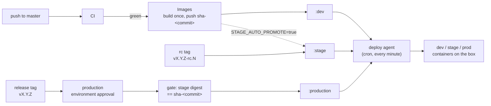

# Environment pipeline runbook

Operator reference for how a commit becomes `dev` -> `stage` -> `production`
on yuriodev.co.uk. For the site's overall architecture see the repo root
`CLAUDE.md`; this file covers the pipeline only.

## Overview



Nothing is ever rebuilt after `images.yml`: every later step is a
`docker buildx imagetools create --prefer-index=false` retag, so the exact
same digest that passed CI is what production eventually runs. The deploy
agent is the only thing that ever touches running containers on the box; the
workflows only move registry tags.

## How to release

1. **Land on `master`.** A push to `master` triggers `.github/workflows/ci.yml`:
   `frontend` (typecheck, lint at 0 problems, `npm run test`, build, `npm audit
   --audit-level=high`), `backend` (`python -m pytest -q`), `guards`
   (`scripts/check-compose.py` plus `docker compose ... config --quiet` on
   every compose file) and `images` (build-only `runtime` + `dev` targets, no
   push). On green CI, `.github/workflows/images.yml` fires via
   `workflow_run`, builds each service's `runtime` target once, pushes
   `ghcr.io/yuriioks/yuriodev-{frontend,backend}:sha-<commit>`, scans it with
   Trivy (blocks on a fixable HIGH/CRITICAL CVE), and — only if that
   passes — retags `:dev` to that digest. The deploy agent picks up `:dev` on
   its next run (within a minute) and `dev.yuriodev.co.uk` updates itself —
   no manual step.
2. **Promote to stage** once you want a specific commit on
   `stage.yuriodev.co.uk`:
   ```bash
   git fetch origin && git log HEAD..origin/master --oneline   # confirm the commit is on master and CI/Images are green
   git tag v1.4.0-rc.1 <commit-sha>
   git push origin v1.4.0-rc.1
   ```
   This runs `.github/workflows/promote-stage.yml`, which requires the tag to
   point at a commit that is an ancestor of `origin/master` and waits for
   both `CI` and `Images` to report success for that exact SHA before
   retagging `:stage`. Same rc tag naming, iterate `-rc.2`, `-rc.3`, ... for
   fixes.
3. **Promote to production** once stage has been verified:
   ```bash
   git tag v1.4.0 <commit-sha>
   git push origin v1.4.0
   ```
   This runs `.github/workflows/promote-production.yml` under the `production`
   GitHub environment, which requires reviewer approval (`YuriiOks`) in the
   Actions UI before the job continues. The gate step then re-checks that
   `:stage` for both `frontend` and `backend` is running the exact digest of
   `sha-<tagged commit>` — if stage has since moved on, the promotion fails
   and tells you to promote to stage first. On success it retags
   `:production`, fast-forwards the `production` branch to that commit, and
   creates a GitHub Release named `v1.4.0` listing both image digests (this
   is also the rollback reference — see below).
4. The deploy agent notices the moved `:production` tag on its next run and
   recreates the changed service(s) on the live box.

Tag regex reminder: `promote-stage.yml` only acts on
`^v[0-9]+\.[0-9]+\.[0-9]+-rc\.[0-9]+$`; `promote-production.yml` only acts on
`^v[0-9]+\.[0-9]+\.[0-9]+$` (no `-rc` suffix). A tag that matches neither is a
no-op for both workflows. Both `v*` tags are admin-only to create per the
repo ruleset.

## Automatic stage promotion

While the repo variable `STAGE_AUTO_PROMOTE` is `true`, every green
`images.yml` run also retags `:stage` to the commit it just built — stage
then tracks every master push, same as dev, and you can skip step 2 above
entirely. Toggle it:
```bash
gh variable set STAGE_AUTO_PROMOTE --body true    # stage tracks master automatically
gh variable set STAGE_AUTO_PROMOTE --body false   # stage only moves on an explicit rc tag
gh variable list                                  # check the current value
```

## Dry-run mode

The repo variable `PROD_DRY_RUN`, when `true`, makes
`promote-production.yml` run every check (ancestry, approval, the
stage-digest gate) and write its summary, but skip the actual retag, the
`production` branch fast-forward, and the GitHub Release — nothing changes.
Useful for rehearsing a release tag or testing the gate logic without moving
production.
```bash
gh variable set PROD_DRY_RUN --body true
gh variable set PROD_DRY_RUN --body false
```

## The deploy agent

`deploy/agent/yuriodev-deploy.sh`, invoked every minute from the user
crontab:
```
* * * * * ENABLED_ENVS="dev stage" /home/yurii/yuriodev-deployment/deploy/agent/yuriodev-deploy.sh
```
For each environment named in `ENABLED_ENVS` (space-separated; e.g. `"dev
stage prod"`) it reads that environment's compose file (`deploy/dev/compose.yml`,
`deploy/stage/compose.yml`, or the root `docker-compose.yml` for `prod`),
finds every service whose `image:` starts with `ghcr.io/`, pulls it
anonymously (the GHCR packages are public; the server holds no registry
credentials), and — only if the pulled image ID differs from what the
running container has — recreates that one service with
`docker compose up -d --no-deps <svc>`. It then waits for the new container
to come healthy before logging it as deployed: both the frontend and backend
images carry a Dockerfile `HEALTHCHECK`, so it polls `docker inspect`'s
`.State.Health.Status` for up to ~90s; only an image without a `HEALTHCHECK`
(an older, pre-hardening image) falls back to a request through the proxy
container (`GET /` for frontends, `GET /health` for backends, up to 6 tries
5s apart). If the new container doesn't come healthy, it puts the previous
image back (see "Automatic rollback and quarantine" below). It never touches
a service that isn't already updated, and it
never builds anything, and it never reacts to an `env/` file changing — only
to a changed image ID (see "Environment config" below).

- **Kill switch:** `touch ~/.yuriodev-deploy-paused` — the agent exits
  immediately on its next run without touching any container. Running
  containers keep running. Remove the file to resume.
- **Log:** `~/.local/state/yuriodev-deploy.log` (the agent's own structured
  lines: `<timestamp> <env> <svc> DEPLOYED|FAILED|ROLLED BACK|ROLLBACK
  FAILED|SKIPPED|QUARANTINE lifted|ERROR|REFUSED ...`, plus `WARN` lines
  about the optional alert files). Once it passes 5 MB it is rotated to
  `.log.1` (older ones shift to `.2` and `.3`; the fourth is dropped). The
  crontab additionally redirects raw stdout/stderr to
  `~/.local/state/yuriodev-deploy.cron.log`, which is not rotated.
- **Heartbeat:** `~/.local/state/yuriodev-deploy.heartbeat` — touched at the
  end of every run that wasn't paused/locked-out; a stale timestamp means the
  agent stopped running, or aborted on an unexpected error (look for
  `ERROR agent aborted at line N` in the log, then the crontab and the cron log).
- **Lock:** the script takes a non-blocking `flock` on
  `~/.local/state/yuriodev-deploy.lock`, so an overrunning invocation (a
  rollback can take a few minutes of health waits) is skipped rather than
  overlapped.
- **Exit status:** 0, or 1 when any enabled environment logged an
  `ERROR`/`FAILED`/`REFUSED` line (a failed pull included). One environment
  failing never stops the others from being processed.

### Automatic rollback and quarantine

Before recreating a service the agent records the image ID the running
container uses. If the recreate fails, or the new container does not come
healthy within the wait above, the agent:

1. logs `<env> <svc> FAILED health check after deploying <repo@sha256:...>;
   rolling back to <previous image ID>`;
2. points the local tag (`:dev` / `:stage` / `:production`) back at that
   previous image ID and recreates the service from it
   (`docker compose up -d --no-deps --force-recreate <svc>`), then waits for
   health again: `ROLLED BACK to ...` on success, `ROLLBACK FAILED to ...`
   (the service is still unhealthy — needs a human) otherwise;
3. quarantines the failed digest in
   `~/.local/state/yuriodev-deploy.quarantine/<env>.<svc>` and keeps a local
   copy of the failed image as `<repo>:quarantined-<env>`, so the next pulls
   don't download it again;
4. sends the optional alert (below) and exits 1.

A service that had no container yet has nothing to roll back to: the agent
logs `FAILED ... no previous container to roll back to`, quarantines and
alerts.

While the registry tag still points at the quarantined digest, every run
pulls it, sees it is quarantined, points the local tag back at the running
image (so a manual `docker compose up` can't start the failed one either) and
skips the service. It logs `SKIPPED quarantined ...` once, not every minute.
The quarantine lifts by itself as soon as the registry tag moves to any other
digest (a new master commit for dev, a new rc tag for stage,
`rollback-production.yml` or a new release for prod): the agent logs
`QUARANTINE lifted: the tag moved from ... to ...`, drops the held copy, and
deploys the new digest as usual (or does nothing, if the tag moved back to
what is already running).

To retry the **same** digest by hand, for example after fixing an
environment-side cause such as a missing secret:
```bash
ls ~/.local/state/yuriodev-deploy.quarantine/                  # one file per quarantined <env>.<svc>
cat ~/.local/state/yuriodev-deploy.quarantine/dev.frontend-dev  # the quarantined digest
rm -f ~/.local/state/yuriodev-deploy.quarantine/dev.frontend-dev \
      ~/.local/state/yuriodev-deploy.quarantine/dev.frontend-dev.noted
tail -f ~/.local/state/yuriodev-deploy.log                        # the next run (within a minute) deploys it again
```
(`rm -rf ~/.local/state/yuriodev-deploy.quarantine` resets every service.) The
held `<repo>:quarantined-<env>` image is removed on the next successful
deploy of that service.

This only catches an image that fails its health check. A release that is
healthy but wrong still needs the release rollback below.

### Alerts and a dead-man's switch (optional, off by default)

Two optional files, each holding one `http(s)://` URL on its first line. The
agent ignores a file (and logs a `WARN`) unless it is owned by `yurii` and has
mode 600 (or 400), and it never writes either URL to its log. Nothing lives in
the repo.

- `~/.config/yuriodev/deploy-alert-url`: on every `FAILED`, `ROLLED BACK` or
  `ROLLBACK FAILED`, the agent POSTs a one-line plain-text message
  (`curl -fsS -m 10 --retry 2 --data-binary "<message>" <url>`). Anything that
  accepts a plain POST body works, for example an ntfy.sh topic URL
  (`https://ntfy.sh/<long-random-topic>`) or a healthchecks.io check's
  `/fail` URL (`https://hc-ping.com/<uuid>/fail`). A failed delivery is
  logged as `WARN alert delivery failed` and never stops the run.
- `~/.config/yuriodev/deploy-ping-url`: a plain GET at the end of every run
  that exited 0 (a quarantined service that is being skipped counts as 0).
  Point it at a healthchecks.io check (`https://hc-ping.com/<uuid>`) with a
  period of 1 minute and a grace time of about 10 minutes: the check goes
  down, and emails you, when the agent stops running, aborts, or keeps
  failing (a GHCR outage longer than the grace time included). Paused or
  locked-out runs don't ping, so pausing the agent for longer than the grace
  time also alerts; pause the check in healthchecks.io first if that is
  planned.

Using one healthchecks.io check for both (the ping URL, and the same URL with
`/fail` as the alert URL) gives an immediate "down" on a failed deploy and a
dead-man's switch for everything else. Setup:
```bash
mkdir -p ~/.config/yuriodev && chmod 700 ~/.config/yuriodev
( umask 077 && printf '%s\n' 'https://hc-ping.com/<uuid>/fail' > ~/.config/yuriodev/deploy-alert-url )
( umask 077 && printf '%s\n' 'https://hc-ping.com/<uuid>'      > ~/.config/yuriodev/deploy-ping-url )
stat -c '%a %U %n' ~/.config/yuriodev/deploy-*-url                 # expect 600 yurii
```
Remove a file to switch that part off again.

## Environment config (`env/`)

Each backend service's non-secret config is tracked in `env/<env>.env`
(`local`, `dev`, `stage`, `prod` — `ENVIRONMENT`, `API_TITLE`, `API_VERSION`,
`CORS_ORIGINS`, `LOG_LEVEL`). Real secrets, if any, go in a gitignored
`env/<env>.secrets.env` (mode 600, created on whichever machine runs that
environment; there is no such file on this box yet). `env/secrets.env.example`
lists the expected secret variable *names* only, never values — start there
when adding one. SOPS+age encryption of the secrets files in place, same
filenames, is planned but not built yet.

Every compose file's backend service loads both, in this order, via the long
`env_file` form:
```yaml
env_file:
  - path: ./env/<env>.env
    required: true
  - path: ./env/<env>.secrets.env   # gitignored
    required: false
```
so a missing secrets file is fine (the public config still loads) and a
secret can only *add* to the public config, never silently replace it by
being absent.

To add or change a value:
```bash
$EDITOR env/dev.env                                    # or env/stage.env, env/prod.env
git add env/dev.env && git commit -m "..."              # this is a tracked, public file
touch ~/.yuriodev-deploy-paused                          # optional belt-and-braces
docker compose -f deploy/dev/compose.yml up -d --no-deps backend-dev
curl -sk -u <user>:<pass> https://dev.yuriodev.co.uk/api/health | python3 -m json.tool   # dev is behind basic auth (credentials at ~/.config/yuriodev/basic-auth.txt); or the internal /health; confirm it took
rm ~/.yuriodev-deploy-paused
```
Recreating just that one service picks up the new env file; it does not
rebuild or affect the other service or environment. **The deploy agent never
reacts to an env file changing** — only to a changed image ID — so this
recreate step is always a manual, one-off action, every time. Production
follows the same pattern via `env/prod.env` and the root `docker-compose.yml`
`backend` service. Every step above — the git commit, the container recreate
— is a production change per root `CLAUDE.md` regardless of which
environment it's for: **ask Yurii first**, dev/stage included, not only prod.

The pre-`env/` files (`backend/.env`, `backend/.env.example`,
`deploy/{dev,stage}/backend.env`) were retired on 2026-09-24 after a full
release cycle on `env/`; don't recreate them, and never read or print any
`env/*.secrets.env`.

## Local development

Mac only — **never run this on the VPS.** `compose.local.yml` (project
`yuriodev-local`, its own Docker network, nothing shared with `yuriodev-network`)
builds each Dockerfile's `dev` target (Vite dev server with HMR on
`127.0.0.1:5173`; `uvicorn --reload` on `127.0.0.1:8000`) with the source bind
-mounted in, and loads `env/local.env`. The frontend's Vite dev-server proxy
for `/api` is pointed at the local backend container via
`VITE_API_PROXY_TARGET=http://backend:8000` (compose `environment:`, not
baked into any build). The root `Makefile` wraps it: `make dev-up` /
`dev-down` / `dev-logs` / `dev-ps` / `dev-test` (runs `npm run test` and
`pytest` inside the running containers) / `typecheck` / `lint` / `check`
(typecheck + lint + tests + `scripts/check-compose.py`, the same guard
`ci.yml`'s `frontend`/`backend`/`guards` jobs run — it doesn't cover
`npm run build` or `npm audit`, which stay CI-only).

## Monitoring

`.github/workflows/uptime.yml` runs on a 10-minute cron and, entirely from
outside (through Cloudflare, not from this box), checks that production's
`/` returns 200, `/api/health` reports `status: healthy` and
`environment: prod`, and that its `revision` matches the commit behind the
latest GitHub Release once that release is at least 20 minutes old (a fresh
promotion gets that long to actually land). Any failure opens or updates one
GitHub issue labelled `monitor` (which emails the repo owner) with the exact
problem list, and the issue auto-closes with a comment once checks pass
again — `gh issue list --label monitor --state open` shows whether one is
currently open. `workflow_dispatch` with `simulate_failure: true` exercises
the whole alert path without a real incident. GitHub disables the schedule
after 60 days with no commit to `master`, so a long-quiet repo needs a
reminder to push something.

## Rollback

`.github/workflows/rollback-production.yml` is a `workflow_dispatch`
workflow, run from the Actions tab (Actions -> Rollback production -> Run
workflow) or with `gh workflow run rollback-production.yml -f tag=vX.Y.Z`.
Its `tag` input is an earlier **release tag** (one that already has a GitHub
Release from a successful production promotion). Like `promote-production.yml`
it runs under the `production` GitHub environment, so it also needs reviewer
approval before it retags `:production` back to that release's recorded
digests. The deploy agent then recreates whatever changed on its next run,
same as any other promotion — no separate rollback procedure on the box.
Check that release's notes (or the workflow's own summary) for the exact
digests it moved to. The deploy agent's own automatic rollback (see
"Automatic rollback and quarantine" above) only covers an image that fails
its health check; moving `:production` back with this workflow also lifts
any quarantine the agent is holding for prod.

## Break-glass: building directly on the box

Only for when GitHub Actions itself is unavailable and production needs a
fix immediately. Since the agent re-pulls `:production` every minute, a
locally built image gets reverted within a minute unless you pause the
agent first:
```bash
touch ~/.yuriodev-deploy-paused                     # 1. stop the agent from reverting you
docker compose build <svc>                          # 2. build from the current working tree
docker compose up -d --no-deps <svc>                 #    (one service, per the golden rules — ask Yurii first)
.claude/scripts/smoke-test.sh                        # 3. verify
```
This leaves production running an image that doesn't match any registry tag.
Resume the normal pipeline afterward with a real release (tag `vX.Y.Z` from
the fixed commit on `master` through the usual promotion flow) — don't leave
the pause file in place, and don't leave production permanently diverged
from what `:production` points at.

## Where credentials live (paths only — never print these)

- Dev/stage basic auth: htpasswd file at `nginx-proxy/auth/envs.htpasswd`
  (gitignored); plaintext credentials at `~/.config/yuriodev/basic-auth.txt`
  (mode 600).
- Backend runtime secrets, current: `env/<env>.secrets.env` (gitignored,
  mode 600, one file per environment, created on the machine that runs it —
  none exist on this box yet); variable names only in
  `env/secrets.env.example`. See "Environment config" above.
- Origin TLS: `nginx-proxy/certs/origin.{pem,key}` (gitignored).
- GHCR: no credentials on the box at all — every pull is anonymous against
  public packages; every push/retag happens inside GitHub Actions using the
  repo's built-in `GITHUB_TOKEN`.

## Troubleshooting

| Symptom | Likely cause | Check |
|---|---|---|
| 502/504 on a vhost (prod/dev/stage) | The upstream container for that env is down or unhealthy | `docker compose ps` (prod) or `docker compose -f deploy/<env>/compose.yml ps`; `docker compose logs --tail 200 <svc>` |
| 401 on dev/stage | Basic auth working as intended, or wrong/missing credentials | Expected without credentials; with credentials, compare against `~/.config/yuriodev/basic-auth.txt` and `nginx-proxy/auth/envs.htpasswd` |
| dev not updating after a master push | CI or Images failed, or the agent is paused/not running | Check the `CI`/`Images` run status (`gh run list --workflow=ci.yml`, `--workflow=images.yml`); `ls ~/.yuriodev-deploy-paused`; heartbeat freshness; `tail ~/.local/state/yuriodev-deploy.log` |
| stage not moving on an rc tag | Tag doesn't match the rc regex, CI/Images not green for that SHA yet, or `promote-stage.yml` failed | `gh run list --workflow=promote-stage.yml`; confirm the tag is exactly `vX.Y.Z-rc.N`; confirm the tagged commit is on `master` and both `CI` and `Images` succeeded for it |
| production promotion blocked at the gate | `:stage` isn't running the digest of the tagged commit | Promote that commit to stage first (or wait for `STAGE_AUTO_PROMOTE`), then retag `vX.Y.Z` |
| production promotion stuck | Waiting on `production` environment approval | Approve the run in the Actions UI (reviewer `YuriiOks`) |
| Agent log shows `ROLLED BACK` / `SKIPPED quarantined` and an env stays on the old revision | The new image failed its health check on the box; the agent put the previous image back and quarantined the digest | `docker compose [-f deploy/<env>/compose.yml] logs --tail 200 <svc>` from the failed attempt; `ls ~/.local/state/yuriodev-deploy.quarantine/`; fix and ship a new commit/tag (lifts it by itself), or reset it by hand — see "Automatic rollback and quarantine" |
| Agent log shows `ROLLBACK FAILED` | The previous image is unhealthy too (likely an environment-side cause: env file, proxy, network) | Same logs as above, plus `/smoke-test`; the service needs a human |
| Agent log shows `REFUSED image without explicit tag` | A compose file's `image:` was edited to drop its tag | Compose files must pin `:dev` / `:stage` / `:production` explicitly — the agent refuses to guess `:latest` |
| Cloudflare 526 | Origin certificate invalid/expired | See `/cert-status`; certs live at `nginx-proxy/certs/origin.{pem,key}` |
| `/health` or `/api/health` reports the wrong `environment` | Wrong or missing `env/<env>.env` value, or the service was never recreated after an env-file edit (the deploy agent doesn't do this) | Check the compose file's `env_file` order, then follow "Environment config" above to recreate the one service |
| Production monitor issue opened (`monitor` label) | `uptime.yml` found `/`, `/api/health`, or the revision-vs-latest-release check failing from outside | `gh issue list --label monitor --state open` for the exact problem list; then `/smoke-test` from the box itself |
