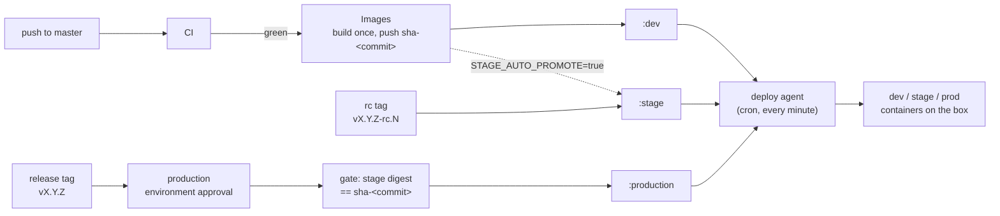

# Environment pipeline runbook

Operator reference for how a commit becomes `dev` -> `stage` -> `production`
on yuriodev.co.uk. For the site's overall architecture see the repo root
`CLAUDE.md`; this file covers the pipeline only.

## Overview



Nothing is ever rebuilt after `images.yml`: every later step is a
`docker buildx imagetools create --prefer-index=false` retag, so the exact
same digest that passed CI is what production eventually runs. The deploy
agent is the only thing that ever touches running containers on the box; the
workflows only move registry tags.

## How to release

1. **Land on `master`.** A push to `master` triggers `.github/workflows/ci.yml`
   (frontend typecheck/build/lint, backend `/health` test, image build-only
   checks). On green CI, `.github/workflows/images.yml` fires via
   `workflow_run`, builds each service once, and pushes
   `ghcr.io/yuriioks/yuriodev-{frontend,backend}:sha-<commit>`, then always
   retags `:dev` to that digest. The deploy agent picks up `:dev` on its next
   run (within a minute) and `dev.yuriodev.co.uk` updates itself — no manual
   step.
2. **Promote to stage** once you want a specific commit on
   `stage.yuriodev.co.uk`:
   ```bash
   git fetch origin && git log HEAD..origin/master --oneline   # confirm the commit is on master and CI/Images are green
   git tag v1.4.0-rc.1 <commit-sha>
   git push origin v1.4.0-rc.1
   ```
   This runs `.github/workflows/promote-stage.yml`, which requires the tag to
   point at a commit that is an ancestor of `origin/master` and waits for
   both `CI` and `Images` to report success for that exact SHA before
   retagging `:stage`. Same rc tag naming, iterate `-rc.2`, `-rc.3`, ... for
   fixes.
3. **Promote to production** once stage has been verified:
   ```bash
   git tag v1.4.0 <commit-sha>
   git push origin v1.4.0
   ```
   This runs `.github/workflows/promote-production.yml` under the `production`
   GitHub environment, which requires reviewer approval (`YuriiOks`) in the
   Actions UI before the job continues. The gate step then re-checks that
   `:stage` for both `frontend` and `backend` is running the exact digest of
   `sha-<tagged commit>` — if stage has since moved on, the promotion fails
   and tells you to promote to stage first. On success it retags
   `:production`, fast-forwards the `production` branch to that commit, and
   creates a GitHub Release named `v1.4.0` listing both image digests (this
   is also the rollback reference — see below).
4. The deploy agent notices the moved `:production` tag on its next run and
   recreates the changed service(s) on the live box.

Tag regex reminder: `promote-stage.yml` only acts on
`^v[0-9]+\.[0-9]+\.[0-9]+-rc\.[0-9]+$`; `promote-production.yml` only acts on
`^v[0-9]+\.[0-9]+\.[0-9]+$` (no `-rc` suffix). A tag that matches neither is a
no-op for both workflows. Both `v*` tags are admin-only to create per the
repo ruleset.

## Automatic stage promotion

While the repo variable `STAGE_AUTO_PROMOTE` is `true`, every green
`images.yml` run also retags `:stage` to the commit it just built — stage
then tracks every master push, same as dev, and you can skip step 2 above
entirely. Toggle it:
```bash
gh variable set STAGE_AUTO_PROMOTE --body true    # stage tracks master automatically
gh variable set STAGE_AUTO_PROMOTE --body false   # stage only moves on an explicit rc tag
gh variable list                                  # check the current value
```

## Dry-run mode

The repo variable `PROD_DRY_RUN`, when `true`, makes
`promote-production.yml` run every check (ancestry, approval, the
stage-digest gate) and write its summary, but skip the actual retag, the
`production` branch fast-forward, and the GitHub Release — nothing changes.
Useful for rehearsing a release tag or testing the gate logic without moving
production.
```bash
gh variable set PROD_DRY_RUN --body true
gh variable set PROD_DRY_RUN --body false
```

## The deploy agent

`deploy/agent/yuriodev-deploy.sh`, invoked every minute from the user
crontab:
```
* * * * * ENABLED_ENVS="dev stage" /home/yurii/yuriodev-deployment/deploy/agent/yuriodev-deploy.sh
```
For each environment named in `ENABLED_ENVS` (space-separated; e.g. `"dev
stage prod"`) it reads that environment's compose file (`deploy/dev/compose.yml`,
`deploy/stage/compose.yml`, or the root `docker-compose.yml` for `prod`),
finds every service whose `image:` starts with `ghcr.io/`, pulls it
anonymously (the GHCR packages are public; the server holds no registry
credentials), and — only if the pulled image ID differs from what the
running container has — recreates that one service with
`docker compose up -d --no-deps <svc>`, then polls it through the proxy
container (`GET /` for frontends, `GET /health` for backends, up to 6 tries
5s apart) before logging it as deployed. It never touches a service that
isn't already updated, and it never builds anything.

- **Kill switch:** `touch ~/.yuriodev-deploy-paused` — the agent exits
  immediately on its next run without touching any container. Running
  containers keep running. Remove the file to resume.
- **Log:** `~/.local/state/yuriodev-deploy.log` (the agent's own structured
  lines: `<timestamp> <env> <svc> DEPLOYED|FAILED|ERROR ...`). The crontab
  additionally redirects raw stdout/stderr to
  `~/.local/state/yuriodev-deploy.cron.log`.
- **Heartbeat:** `~/.local/state/yuriodev-deploy.heartbeat` — touched at the
  end of every run that wasn't paused/locked-out; a stale timestamp means the
  agent stopped running (check the crontab and the cron log first).
- **Lock:** the script takes a non-blocking `flock` on
  `~/.local/state/yuriodev-deploy.lock`, so an overrunning invocation is
  skipped rather than overlapped.

## Adding a new environment variable to dev or stage

Each environment's backend variables live in a gitignored env file next to
its compose file (`deploy/dev/backend.env`, `deploy/stage/backend.env`;
start from `backend/.env.example` for the variable names). To add or change
one:
```bash
$EDITOR deploy/dev/backend.env          # or deploy/stage/backend.env
docker compose -f deploy/dev/compose.yml up -d --no-deps backend-dev
```
Recreating just that service picks up the new env file; it does not rebuild
or affect the other service or environment. Production's backend env file
(`backend/.env`, also gitignored) follows the same pattern via the root
`docker-compose.yml` and `backend` service, but is a production change — ask
first.

## Rollback

`.github/workflows/rollback-production.yml` is a `workflow_dispatch`
workflow, run from the Actions tab (Actions -> Rollback production -> Run
workflow) or with `gh workflow run rollback-production.yml -f tag=vX.Y.Z`.
Its `tag` input is an earlier **release tag** (one that already has a GitHub
Release from a successful production promotion). Like `promote-production.yml`
it runs under the `production` GitHub environment, so it also needs reviewer
approval before it retags `:production` back to that release's recorded
digests. The deploy agent then recreates whatever changed on its next run,
same as any other promotion — no separate rollback procedure on the box.
Check that release's notes (or the workflow's own summary) for the exact
digests it moved to.

## Break-glass: building directly on the box

Only for when GitHub Actions itself is unavailable and production needs a
fix immediately. Since the agent re-pulls `:production` every minute, a
locally built image gets reverted within a minute unless you pause the
agent first:
```bash
touch ~/.yuriodev-deploy-paused                     # 1. stop the agent from reverting you
docker compose build <svc>                          # 2. build from the current working tree
docker compose up -d --no-deps <svc>                 #    (one service, per the golden rules — ask Yurii first)
.claude/scripts/smoke-test.sh                        # 3. verify
```
This leaves production running an image that doesn't match any registry tag.
Resume the normal pipeline afterward with a real release (tag `vX.Y.Z` from
the fixed commit on `master` through the usual promotion flow) — don't leave
the pause file in place, and don't leave production permanently diverged
from what `:production` points at.

## Where credentials live (paths only — never print these)

- Dev/stage basic auth: htpasswd file at `nginx-proxy/auth/envs.htpasswd`
  (gitignored); plaintext credentials at `~/.config/yuriodev/basic-auth.txt`
  (mode 600).
- Backend runtime secrets: `backend/.env` (production, gitignored),
  `deploy/dev/backend.env`, `deploy/stage/backend.env` (gitignored); variable
  names only in `backend/.env.example`.
- Origin TLS: `nginx-proxy/certs/origin.{pem,key}` (gitignored).
- GHCR: no credentials on the box at all — every pull is anonymous against
  public packages; every push/retag happens inside GitHub Actions using the
  repo's built-in `GITHUB_TOKEN`.

## Troubleshooting

| Symptom | Likely cause | Check |
|---|---|---|
| 502/504 on a vhost (prod/dev/stage) | The upstream container for that env is down or unhealthy | `docker compose ps` (prod) or `docker compose -f deploy/<env>/compose.yml ps`; `docker compose logs --tail 200 <svc>` |
| 401 on dev/stage | Basic auth working as intended, or wrong/missing credentials | Expected without credentials; with credentials, compare against `~/.config/yuriodev/basic-auth.txt` and `nginx-proxy/auth/envs.htpasswd` |
| dev not updating after a master push | CI or Images failed, or the agent is paused/not running | Check the `CI`/`Images` run status (`gh run list --workflow=ci.yml`, `--workflow=images.yml`); `ls ~/.yuriodev-deploy-paused`; heartbeat freshness; `tail ~/.local/state/yuriodev-deploy.log` |
| stage not moving on an rc tag | Tag doesn't match the rc regex, CI/Images not green for that SHA yet, or `promote-stage.yml` failed | `gh run list --workflow=promote-stage.yml`; confirm the tag is exactly `vX.Y.Z-rc.N`; confirm the tagged commit is on `master` and both `CI` and `Images` succeeded for it |
| production promotion blocked at the gate | `:stage` isn't running the digest of the tagged commit | Promote that commit to stage first (or wait for `STAGE_AUTO_PROMOTE`), then retag `vX.Y.Z` |
| production promotion stuck | Waiting on `production` environment approval | Approve the run in the Actions UI (reviewer `YuriiOks`) |
| Agent log shows `REFUSED image without explicit tag` | A compose file's `image:` was edited to drop its tag | Compose files must pin `:dev` / `:stage` / `:production` explicitly — the agent refuses to guess `:latest` |
| Cloudflare 526 | Origin certificate invalid/expired | See `/cert-status`; certs live at `nginx-proxy/certs/origin.{pem,key}` |
